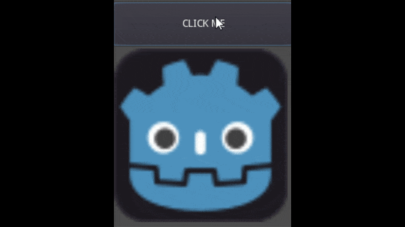

# Button-animation

Here a demo creating a circle effect on buttons using godot engine + shaders

Feel free to use it.

## Godot versions

**master** branch works for Godot 3.1.2 ~ 3.2.1
**2.1** branch works for Godot 2.1

# [LICENSE](./LICENSE)

